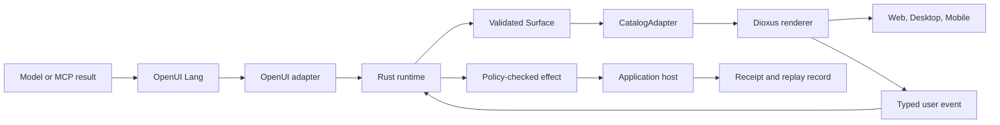

# OpenUI-Dioxus

OpenUI-Dioxus explores a deterministic Rust execution layer for interfaces proposed in OpenUI Lang and rendered with Dioxus on web, desktop, and mobile.

> **Status:** architecture and falsification prototype. The prototype is a technical go, but the product decision remains open until the MCP vertical is compared with a simpler Dioxus adapter.

No package, stable API, compatibility claim, or open-source license has been released yet. Licensing and governance are explicit post-go decisions, not assumptions hidden in the repository setup.

## Why this project exists

An LLM is good at proposing an interface, but its output is stochastic. Production software still needs explicit rules for which components exist, which state changes are legal, which actions may touch the outside world, and what can be replayed later.

OpenUI-Dioxus separates those jobs:

- **OpenUI Lang** describes the proposed interface.
- **Rust** parses, validates, stabilizes, and replays accepted semantics.
- **Dioxus** renders the same accepted Surface across the three target families.
- **Approved design systems** define the closed component vocabulary available to generation.
- **The application host** performs every external effect after typed policy checks.

The project is therefore more than an OpenUI renderer. Its intended value is the complete contract around conformance, catalogs, state, actions, platform behavior, and replay.

## Execution flow

Only a committed, validated Surface can become interactive. Catalog components render declared inputs and emit typed events; they do not perform hidden network, filesystem, navigation, tool, or permission effects.

## Stable engine, two integration seams

| Boundary | Responsibility | What it must not do |
| --- | --- | --- |
| OpenUI adapter | Preserve OpenUI parsing, streaming, patch, state, and action semantics. | Invent a second public wire protocol. |
| Runtime | Validate proposals, own semantic state, commit revisions atomically, mediate actions, and replay inertly. | Depend on a concrete component library or platform. |
| `CatalogAdapter` | Bind one reviewed, statically compiled Dioxus catalog to ordered serializable OpenUI props and typed events. | Load arbitrary code or change runtime semantics. |
| Renderer + `PlatformHost` | Present the Surface and adapt bounded local UI mechanics such as focus, positioning, safe areas, and keyboards. | Perform business or host-visible effects. |
| Application host | Execute policy-checked tools, resources, navigation, network, filesystem, and permission work; return durable receipts. | Bypass runtime authorization or replay rules. |

`v0.1` uses the `static_rust_v1` catalog profile: adding or replacing an adapter recompiles the application. It does **not** promise a stable Rust ABI or dynamic plug-in loading.

## Design-system paths

Native Dioxus systems connect directly through separately certified `CatalogAdapter` implementations:

- Dioxus Components;
- Rust/UI;
- private or organization-specific Dioxus design systems.

Dioxus Primitives may be reused inside an adapter, but they are not a mandatory runtime layer. React, shadcn/ui, Radix, Base UI, React Aria, Ariakit, Figma, JSON, and screenshots are conversion sources: they produce an inert draft, a Rust scaffold, and an unknowns report before human review, compilation, tests, and certification.

## What cross-platform means

The same Surface and semantic events must produce equivalent outcomes on web, desktop, and mobile. Presentation may adapt to native platform constraints when the adaptation is declared and tested. Unsupported behavior must use an explicit equivalent fallback or fail visibly; silent degradation is not allowed.

This is a contract target, not yet a released compatibility claim. The current prototype compiles for the three target feature sets; physical-device accessibility and interaction evidence remain future gates.

## Start here

| Read | Purpose |
| --- | --- |
| [Decision trail](docs/decisions/README.md) | The public Wayfinder map: destination, resolved decisions, open questions, dependencies, and current frontier. |
| [Runtime contract](docs/decisions/06-define-runtime-domain-contract.md) | The 21 canonical invariants for streaming, state, actions, validation, replay, and migration. |
| [Design-system bridge](docs/decisions/07-design-the-design-system-bridge.md) | The catalog manifest, generated artifacts, and future converter boundary. |
| [Cross-platform contract](docs/decisions/08-lock-cross-platform-v01-contract.md) | The web, desktop, mobile, accessibility, catalog portability, and ABI decisions. |
| [Decision-review register](docs/architecture/runtime-contract-review-register.md) | The evidence required to reopen an existing runtime decision during implementation. |
| [ELI5 explainers](docs/explainers/) | Visual explanations of runtime history, catalog generation, adapter seams, and UI primitive layers. |
| [Prototype](prototype/openui-dioxus-preview/README.md) | The runnable eight-component proof, its checks, and its explicit limitations. |

The five visual explainers are also available directly:

- [OpenUI compatibility profile](docs/explainers/compatibility-profile-eli5.html)
- [Runtime contract](docs/explainers/runtime-contract-eli5.html)
- [Design-system bridge](docs/explainers/design-system-bridge-reevaluation-eli5.html)
- [Catalog and platform adapter seams](docs/explainers/adapter-platform-seams-eli5.html)
- [UI primitive layer stack](docs/explainers/ui-primitives-layer-stack-eli5.html)

## Current proof and next decision

The throwaway prototype currently demonstrates a closed eight-component catalog, atomic proposal rejection, typed action mediation, deterministic state updates, inert replay, and compile checks for desktop, web/WASM, and mobile feature sets.

The next frontier is [decision 09: prototype the enriched MCP vertical](docs/decisions/09-prototype-the-mcp-vertical.md). It must compare this architecture with a materially simpler Dioxus adapter before the project claims product value or begins a production runtime.

## `v0.1` non-goals

- Arbitrary model-generated Rust, JavaScript, or executable UI code.
- Dynamic third-party component loading or a stable Rust binary ABI.
- Automatic React, Figma, JSON, or screenshot conversion.
- Pixel-identical rendering across operating systems and WebViews.
- E-ink specialization, a Bun-specific runtime, or commercial product work.

## Evidence and upstream references

Acceptance gates and recorded checks live in [`GATES.md`](GATES.md). Exact OpenUI and Dioxus source snapshots are recorded in [`sources.json`](sources.json); third-party source itself is fetched through OpenSRC and is not vendored here.
